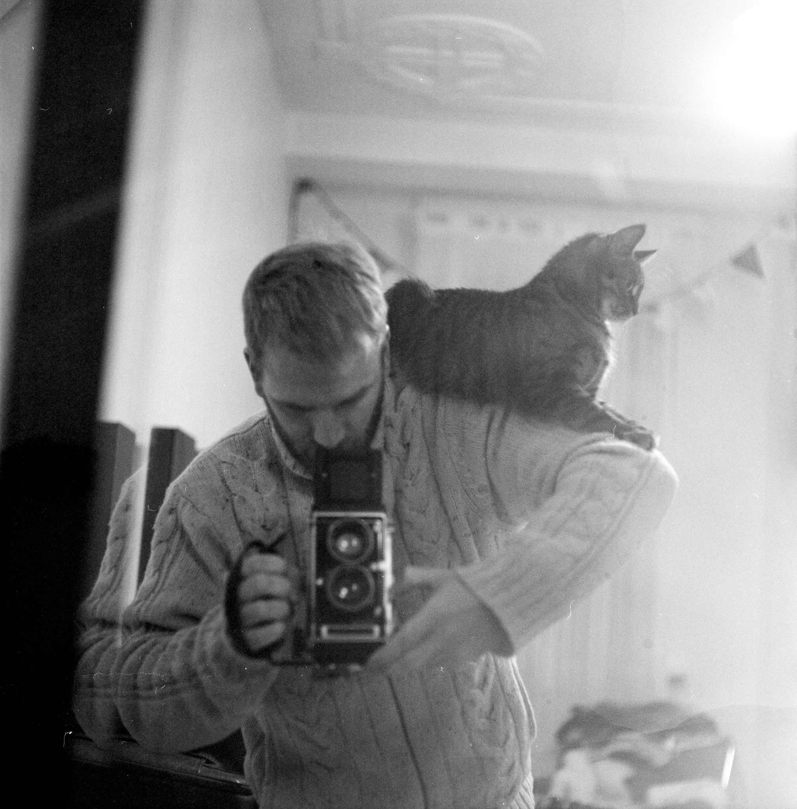

+++
date = "2020-11-22T22:07:33+05:30"
title = "About"
+++

A blog about things i do, mostly nerd, DIY and photo stuff.
<!--more-->
But why another blog about the stuff that every other blog already is about?
Mainly for myself, as an archive that I can access again.
But if there is also something interesting for you, the better.

The first CMS i ever set up was joomla in 2006, then quickly switched to a root server with wordpress for a long time.
But with this blog i want to change some things again. Mostly because i don't need all the overhead from wordpress. So you're reading static HTML delivered from Amazon S3 right now. And i use to Hugo generate the HTML files. Right now writing a new post is a lot of editing and copying files, but will automate this soon.

As compensation for working in tech and have a lot digital activity in my spare time, i'm taking my pictures with analoge cameras and develop myself. And every other year i go into my basement and make some prints.
I'm also interested in DIY electronics, vinyl and ... too much.

That's me:

Mamiya C33

Mamiya 80mm f/2.8

Kodak T-Max 100

### License

Copyright © 2020 [Marcin Mierzejewski](https://mrmierzejewski.com/)

The theme is released under the MIT License. Check the [original theme license](https://github.com/panr/hugo-theme-terminal/blob/master/LICENSE.md) for additional licensing information.
